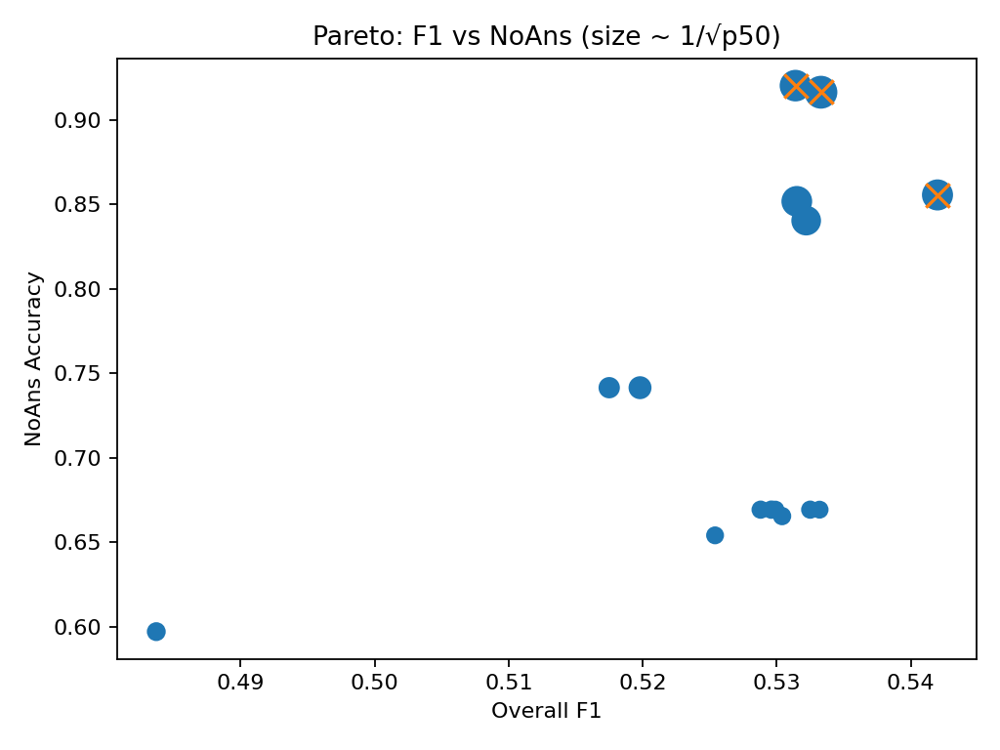
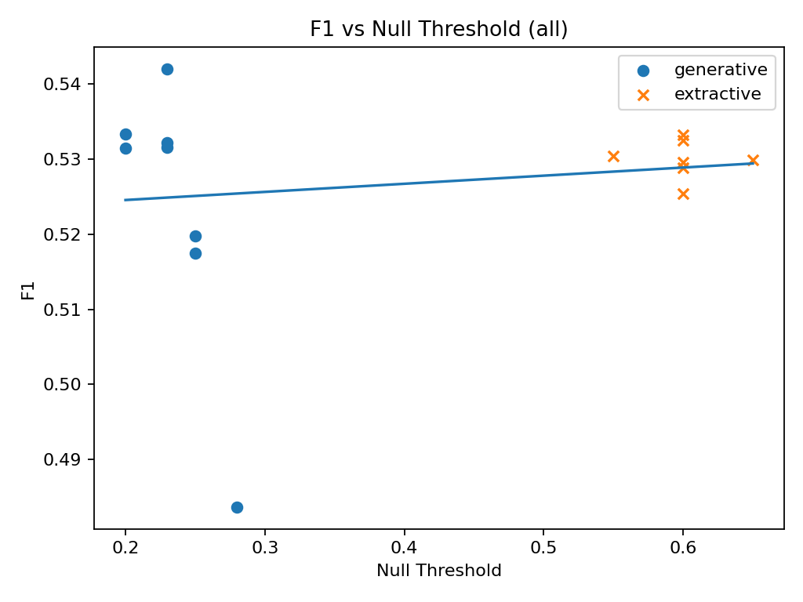
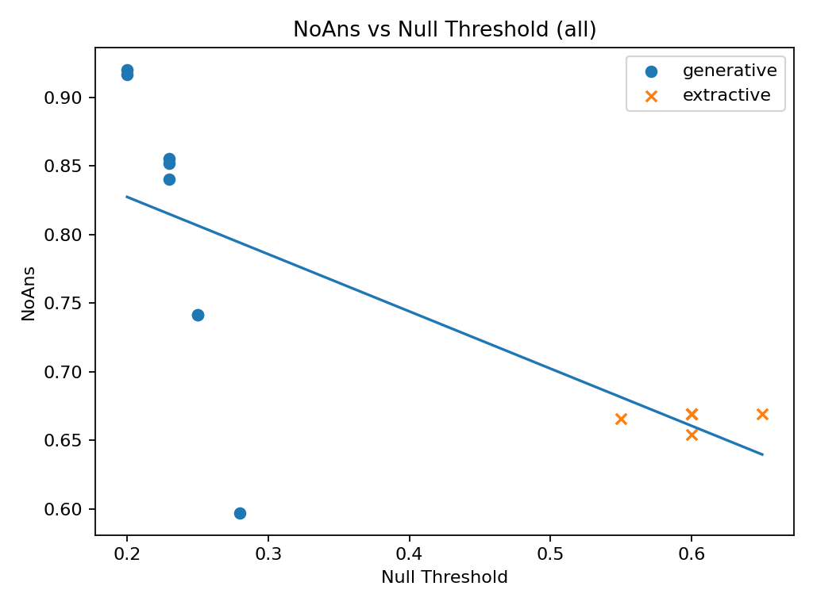
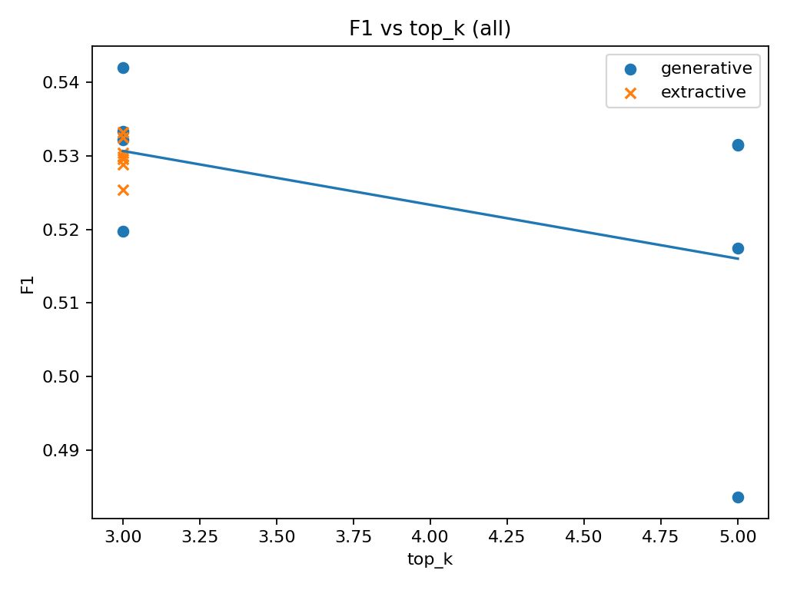
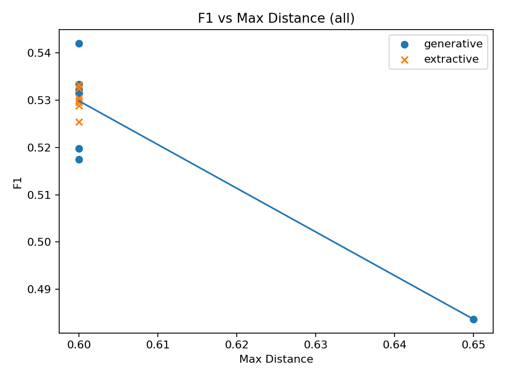
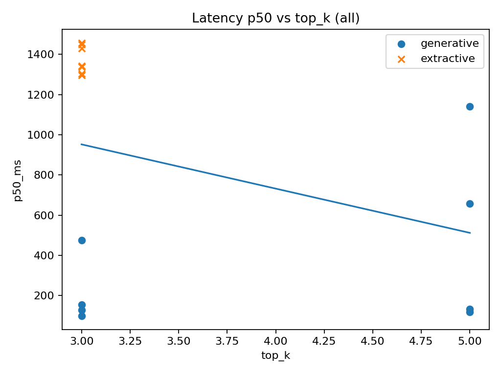
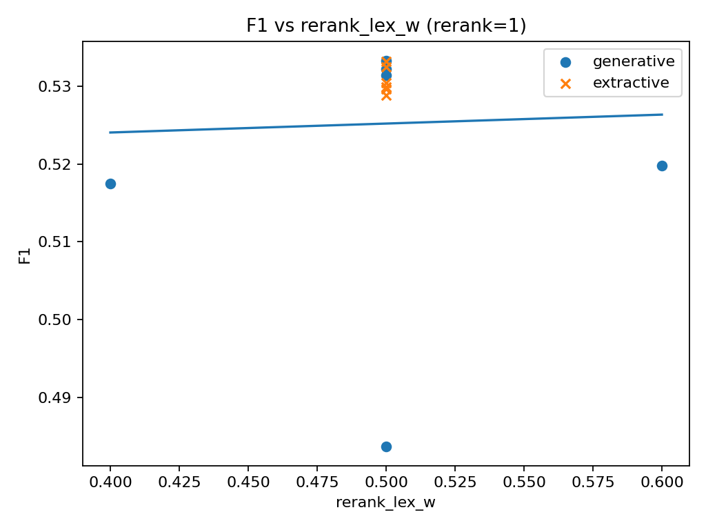

# FastAPI RAG Chatbot (SQuADv2 Demo)

## Overview

Compact Retrieval-Augmented Generation (RAG) service built on FastAPI. Supports ingestion, retrieval + rerank, extractive span selection, and abstention gates. Evaluation scripts generate tables and plots under `docs/`.

## Endpoints (most useful)

- **GET** `/health`
- **GET** `/metrics`
- **GET** `/debug/samples?n=3`
- **GET** `/debug/search?q=...&k=...&max_distance=...`
- **POST** `/rc` (extractive QA given context)
- **POST** `/chat` (full RAG; generative or extractive)

## Repository Structure

### Core Application
```
app/
├── __init__.py
├── main.py
├── settings.py
├── models.py
├── ingest.py
├── retrieval.py
├── metrics.py
├── streamlit_app.py
├── answering/
│   ├── __init__.py
│   └── extractive.py
└── middleware/
    ├── __init__.py
    ├── api_key.py
    ├── logging.py
    └── max_size.py
```

### Evaluation Scripts
```
scripts/
├── aggregate_next.py
├── build_eval_correlations.py
├── retrieval_eval.py
├── run_showcase.py
├── squad_eval.py
├── squad_grid.py
├── squad_search.py
├── squad_to_md.py
└── tune_eval.bat
```

### Generated Results
```
results/
├── 20250919_173803/
├── 20250922_0949/
└── 20250919_173803.zip
```

### Documentation & Analysis
```
docs/
├── combined_eval_table_next.csv
├── corr_summary_next.csv
├── top5_tables_next.md
├── pareto_scatter_next.png
├── corr_matrix_pearson.png
└── corr_*.png (correlation plots)
```

## Recommended Presets

### Generative (fast, calibrated)
```
extractive=0
grounded_only=1
top_k=3
max_distance=0.60
null_threshold=0.20–0.23
rerank=1
rerank_lex_w=0.5
temperature=0
```

### Extractive (strict, slower)
```
extractive=1
grounded_only=1
top_k=3
max_distance=0.60
null_threshold≈0.60
alpha=0.50–0.55
alpha_hits=2
support_min=0.30
support_window=96
span_max_distance=0.60
rerank=1
rerank_lex_w=0.5
temperature=0
```

## Quick Start

### Environment Setup (Windows CMD; API already running)

```cmd
set URL=http://127.0.0.1:8000
set KEY=my-dev-key-1
set DATASET=path\to\dev-v2.0.json
```

### Health Checks

```cmd
curl -s "%URL%/health"
curl -s "%URL%/debug/search?q=Normans&k=5&max_distance=0.60" -H "X-API-Key: %KEY%"
```

## Evaluation Examples

### Generative Configuration
```cmd
docker compose exec api python /workspace/scripts/squad_eval.py \
  --dataset "%DATASET%" \
  --host "%URL%" \
  --api-key "%KEY%" \
  --grounded-only \
  --temperature 0 \
  --top-k 3 \
  --max-distance 0.60 \
  --null-threshold 0.23 \
  --rerank \
  --rerank-lex-w 0.50 \
  --progress \
  --progress-interval 50 \
  --limit 500 \
  --workers 4 \
  --timeout 180 \
  --out /workspace/results/gen_k3_md060_nt0p23_rr1_rw0p5.json
```

### Extractive Configuration
```cmd
docker compose exec api python /workspace/scripts/squad_eval.py \
  --dataset "%DATASET%" \
  --host "%URL%" \
  --api-key "%KEY%" \
  --extractive \
  --grounded-only \
  --temperature 0 \
  --top-k 3 \
  --max-distance 0.60 \
  --null-threshold 0.60 \
  --alpha 0.50 \
  --alpha-hits 2 \
  --support-min 0.30 \
  --support-window 96 \
  --span-max-distance 0.60 \
  --rerank \
  --rerank-lex-w 0.50 \
  --progress \
  --progress-interval 50 \
  --limit 500 \
  --workers 4 \
  --timeout 180 \
  --out /workspace/results/ex_k3_md060_nt0p60_rr1_rw0p5_a0p50_h2_sm0p30_w96_sd0p60.json
```

## Analysis Pipeline

### Generate Aggregate Results and Pareto Plot
```cmd
docker compose exec api python /workspace/scripts/aggregate_next.py /workspace/results/20250922_0949 /workspace/docs
```

**Outputs:**
- `docs/combined_eval_table_next.csv`
- `docs/pareto_scatter_next.png`

### Generate Correlation Analysis and Top-5 Tables
```cmd
docker compose exec -e MPLCONFIGDIR=/tmp/mplconfig api python /workspace/scripts/build_eval_correlations.py \
  --csv /workspace/docs/combined_eval_table_next.csv \
  --out-dir /workspace/docs \
  --pareto
```

**Outputs:**
- `docs/corr_*.png` (correlation plots)
- `docs/corr_summary_next.csv`
- `docs/top5_tables_next.md`
- `docs/pareto_scatter_next.png` (rebuilt with `--pareto`)

## Key Findings & Visualizations

### Performance Analysis

**Pareto of Overall F1 vs NoAns** (point size ~ 1/√p50). Frontier dominated by generative configs around k=3–5, max_distance=0.60, null_threshold≈0.20–0.23. Extractive is lower on NoAns and ~10× slower.

### Threshold Sensitivity

**F1 vs Null Threshold**: F1 is flat across tested null thresholds. Generative stable around 0.20–0.23; extractive stable around 0.55–0.65.


**NoAns vs Null Threshold**: Global slope is mode-confounded. Within mode, generative at low thresholds achieves highest NoAns; raising threshold within generative wasn't required for calibration.

### Retrieval Configuration Impact
*[SCREENSHOT PLACEHOLDER: docs/corr_F1_vs_top_k.png]*

**F1 vs Top K**: Mild downward trend—larger k rarely improves F1 and can dilute generation.

*[SCREENSHOT PLACEHOLDER: docs/corr_F1_vs_max_distance.png]*

**F1 vs Max Distance**: max_distance=0.60 outperforms 0.65 for F1 in this dataset.

### Performance Characteristics
*[SCREENSHOT PLACEHOLDER: docs/corr_p50_vs_top_k.png]*

**Latency vs Top K**: Latency is driven more by mode (generative vs extractive) than by k. Generative p50 ~100–160 ms; extractive ~1300–1450 ms in these runs.

### Optional: Reranking Analysis
*[SCREENSHOT PLACEHOLDER: docs/corr_F1_vs_rerank_lex_w.png]*

**F1 vs Rerank Lexical Weight**: With rerank enabled, lexical weight 0.4–0.6 performs similarly; 0.5 is a safe default.

## Retrieval Health Metrics

Results from `scripts/retrieval_eval.py`:

- **k=3**, max_distance=0.55, Jaccard=0.50 → Recall@3=0.804, Hit@1=0.650, MRR=0.718, p50_ms=29 (workers=1). Answerable recall=0.873; Unanswerable recall=0.741.
- **k=5**, max_distance=0.60, Jaccard=0.50 → Recall@5=0.850, Hit@1=0.650, MRR=0.729, p50_ms=185 (workers=6).
- **k=8**, max_distance=0.65, Jaccard=0.55 → Recall@8=0.880, Hit@1=0.644, MRR=0.729, p50_ms=139 (workers=6).

**Interpretation**: Recall@k rises with k, but Hit@1 stays ~0.65. Future gains likely require stronger reranking or query rewriting rather than larger k.

## Results Summary

The evaluation plots collectively demonstrate:

- **Pareto frontier** is dominated by generative configs near k=3–5, max_distance=0.60, null_threshold≈0.20–0.23 (fast and well-calibrated)
- **F1 vs max_distance**: 0.60 > 0.65 in this dataset
- **F1 vs k**: slight decline as k increases
- **Latency vs k**: mode dominates latency (extractive ≫ generative)
- **Rerank lexical weight** 0.4–0.6 shows little sensitivity; 0.5 is optimal

## License & Data

MIT License. This project evaluates against the Stanford Question Answering Dataset (SQuAD) v2.0.
SQuAD v2.0 is distributed under the Creative Commons Attribution-ShareAlike 4.0
International License (CC BY-SA 4.0). This license applies to the dataset and any
adaptations of the dataset. The source code in this repository is licensed separately
under the MIT License (see LICENSE).